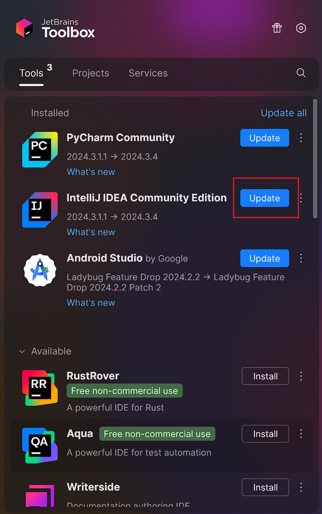
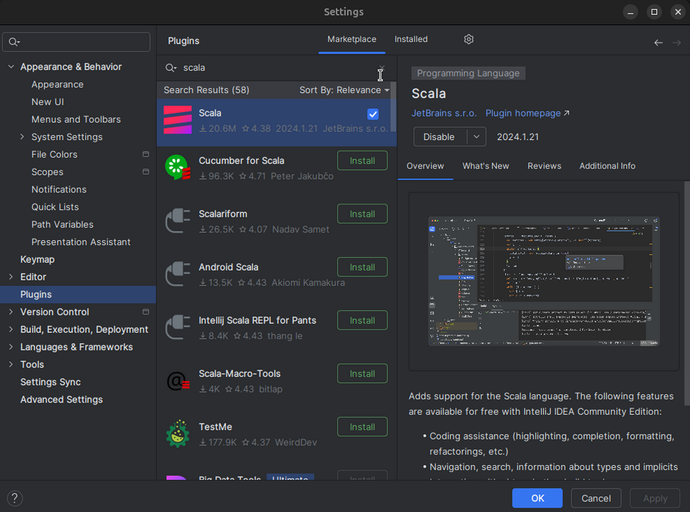
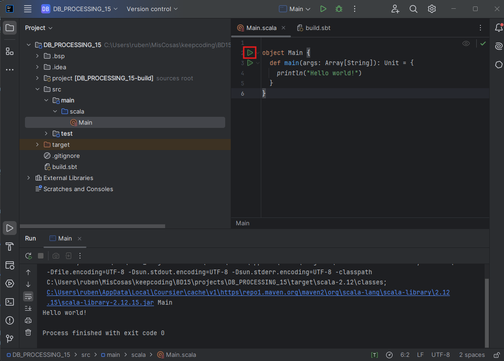
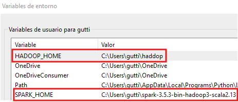
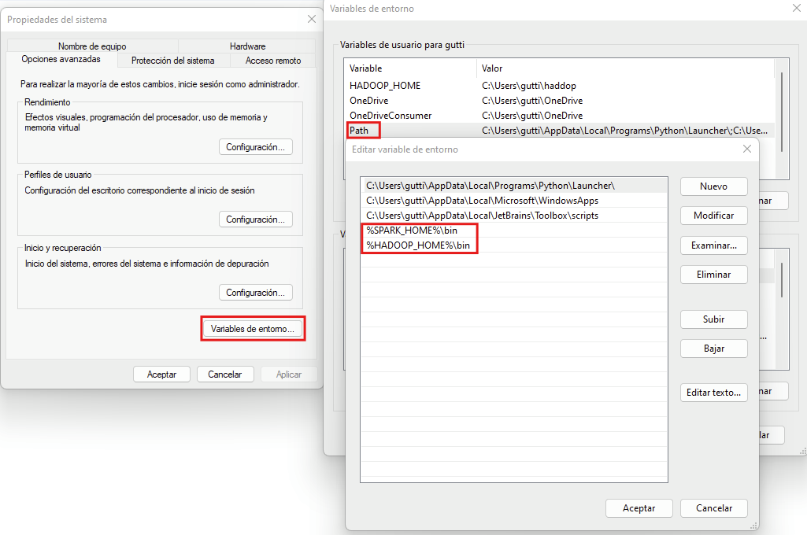
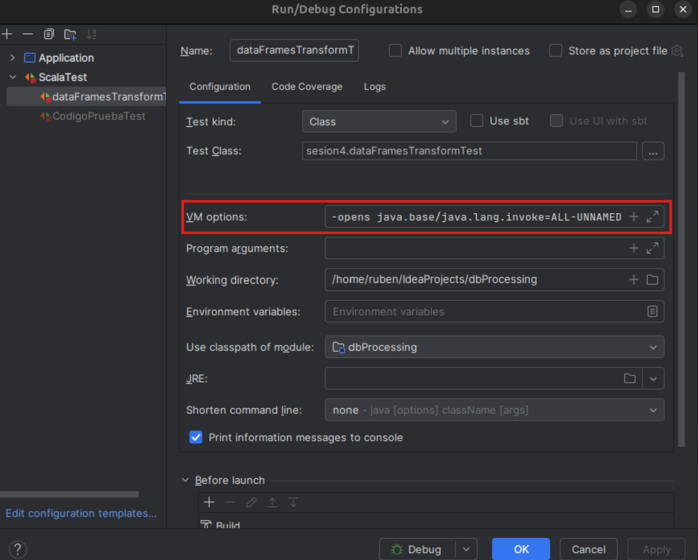

# Big Data Processing


## Material clases
#### [BD-Processing.pdf](imagenes/bd_processing_15.pdf)
#### [Practica](examen)

---
## Instalacion

<details>
   <summary>Scala</summary>
   
   1. Instala Visual Studio Code
   2. (Opcional) Instala [Toolbox](https://www.jetbrains.com/toolbox-app/)
      1. Si Instalas IntelliJ DEA Communbity no necesitas hacer el paso 3
    
        

   3. Instala [IntelliJ](https://www.jetbrains.com/idea/download/)
  
        
   
   4. Pon a punto 
      1. Instalar plugin de Scala 
         1. Seleccionar Plugins
         2. Buscar en Marketplace scala
         3. Instalar
         4. Resetear IntelliJ
         
            
      2. Nuevo projecto 
         1. Tenemos que poner un nombre de proyecto en Name 
         2. Elegir una localización, está bien la que viene por defecto pero yo he puesto mi carpeta personal y me he creado un subdirectorio 
         3. JDK: Necesitamos descargarnos uno si no tenemos:
            1. CLick en el desplegable y seleccionar: Descargar JDK
            2. Botón de descarga
         4. seleccionamos ejemplo de código 
         5. Creamos
      3. Comprobar que ha funcionado 
         1. Click botón verde de play y verán el mensaje en la terminal: Hello world!
         
      
</details>

<details>
   <summary>Spark</summary>
   
   1. Para windows descargar los siguiente:
      1. [hadoop.dll](https://github.com/steveloughran/winutils/blob/master/hadoop-2.7.1/bin/hadoop.dll)
         1. Guardar en esta ruta: C:/Users/<TU_USUARIO>/hadoop/bin
      2. [winutils.exe](https://github.com/steveloughran/winutils/blob/master/hadoop-2.7.1/bin/winutils.exe)
         1. Guardar en esta ruta: C:/Users/<TU_USUARIO>/hadoop/bin
      3. [spark-3.2.4-bin-hadoop2.7](https://archive.apache.org/dist/spark/spark-3.2.4/)
         1. Guardar en esta ruta: C:/Users/<TU_USUARIO>/spark-3.2.4-bin-hadoop2.7 
   
        

        
   
   2. Configurar scalaTest para usar Spark

```txt
--add-opens java.base/java.util=ALL-UNNAMED --add-opens java.base/java.lang=ALL-UNNAMED --add-opens java.base/java.nio=ALL-UNNAMED --add-opens java.base/sun.nio.ch=ALL-UNNAMED --add-opens java.base/java.util.concurrent=ALL-UNNAMED --add-opens java.base/java.lang.invoke=ALL-UNNAMED
```

   

</details>

---

